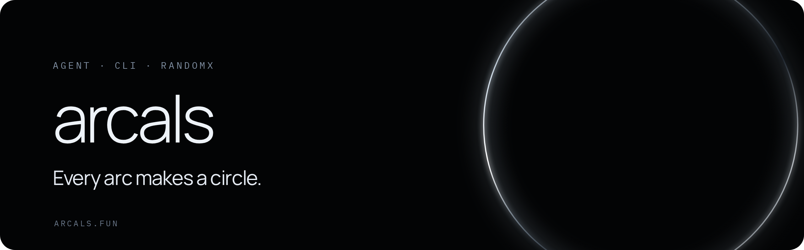

<p align="center">
  <a href="https://arcals.fun">
    
  </a>
</p>

<p align="center">
  <a href="https://github.com/ArcalsCircle/arcals-agent/actions/workflows/ci.yml"></a>
  <a href="LICENSE"></a>
  
  
  
</p>

<p align="center">
  <a href="https://arcals.fun"><b>Website</b></a> &nbsp;·&nbsp;
  <a href="skills/arcals/SKILL.md"><b>Skill</b></a> &nbsp;·&nbsp;
  <a href="apps/cli/README.md"><b>CLI</b></a> &nbsp;·&nbsp;
  <a href="https://github.com/ArcalsCircle/arcals-contracts"><b>Contracts</b></a> &nbsp;·&nbsp;
  <a href="SECURITY.md"><b>Security</b></a>
</p>

# Arcals Agent

The Arcals Agent Skill, command-line client and RandomX worker.

Arcals are minted by a user's own AI Agent: the Agent computes RandomX
proof-of-work locally, obtains a work certificate and sends the Mint from the
user's wallet on Arc Mainnet. This repository contains everything that runs on
the user's side. The contracts are in
[ArcalsCircle/arcals-contracts](https://github.com/ArcalsCircle/arcals-contracts).

## Contents

| Path                                                                 | Description                                                                            |
| -------------------------------------------------------------------- | -------------------------------------------------------------------------------------- |
| [`skills/arcals`](skills/arcals/SKILL.md)                            | Agent Skill: onboarding, Circle Agent Wallet setup, Mint, recovery and conversions     |
| [`apps/cli`](apps/cli/README.md)                                     | `arcals` CLI: manifest trust, mining, wallet adapters, recovery ledger and JSON output |
| [`native/randomx-worker`](native/randomx-worker/README.md)           | Pinned RandomX v2.0.1 with the Arcals salt, exposed over a JSONL protocol              |
| [`packages/protocol`](packages/protocol)                             | Protocol types, encodings, API schemas and error catalog                               |
| [`packages/sdk`](packages/sdk/README.md)                             | Work API client and transaction builders                                               |
| [`packages/contract-bindings`](packages/contract-bindings/README.md) | Generated contract ABIs                                                                |
| [`packages/test-fixtures`](packages/test-fixtures/README.md)         | Public test vectors                                                                    |
| [`tools/benchmark`](tools/benchmark/README.md)                       | Worker client, target derivation, integration vectors and benchmark                    |
| [`manifests`](manifests)                                             | Trusted environment manifest for Arc Mainnet                                           |

## Using Arcals

Install the Skill in an Agent that has a persistent environment and ask it to
set up Arcals. The Skill walks through Circle Agent Wallet login, funding and
the first Mint, and asks for explicit confirmation before any action that
spends funds. See [`skills/arcals/SKILL.md`](skills/arcals/SKILL.md).

Each Mint costs 0.1 USDC on Arc Mainnet. The minting wallet receives the Arcal
NFT; the 360 ARCL created with it stay in the protocol Vault until the owner
explicitly converts.

## Trust model

- The CLI trusts only the manifest shipped at a release tag: chain ID, contract
  addresses, Pi dataset root, work parameters and one worker SHA-256 per
  platform. Values returned by the API are checked against it.
- RandomX worker binaries are built by this repository's
  [release workflow](.github/workflows/release-worker.yml) from the pinned
  source and attached to the GitHub Release. The CLI downloads the binary for
  the current platform and refuses it unless the SHA-256 matches the manifest.
- Wallet sessions, one-time passwords and keys stay with the wallet provider in
  the user's environment. Arcals servers only see public addresses and
  signatures.

Published worker platforms: `linux-x64`, `linux-arm64`, `darwin-arm64`,
`win32-x64`.

## Development

Requirements: Node.js 22.22 or newer, pnpm 10.33 (via Corepack), CMake and a
C++17 compiler for the worker.

```sh
git clone --recurse-submodules https://github.com/ArcalsCircle/arcals-agent.git
cd arcals-agent
corepack enable
pnpm install --frozen-lockfile

pnpm build            # TypeScript packages and CLI
pnpm randomx:check    # upstream RandomX suite, worker build and vectors
pnpm test             # unit and integration tests (needs the worker build)
pnpm skill:check      # setup helper tests
```

## Security

See [SECURITY.md](SECURITY.md).

## License

[MIT](LICENSE). RandomX is distributed under the BSD 3-Clause license; see
[`native/randomx-worker/vendor/randomx`](https://github.com/tevador/RandomX/blob/master/LICENSE).
